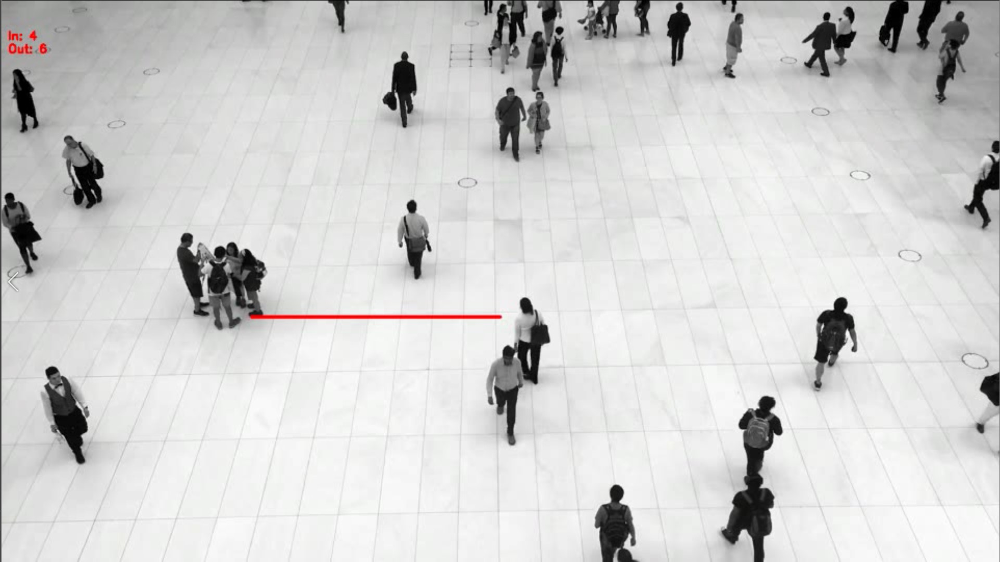
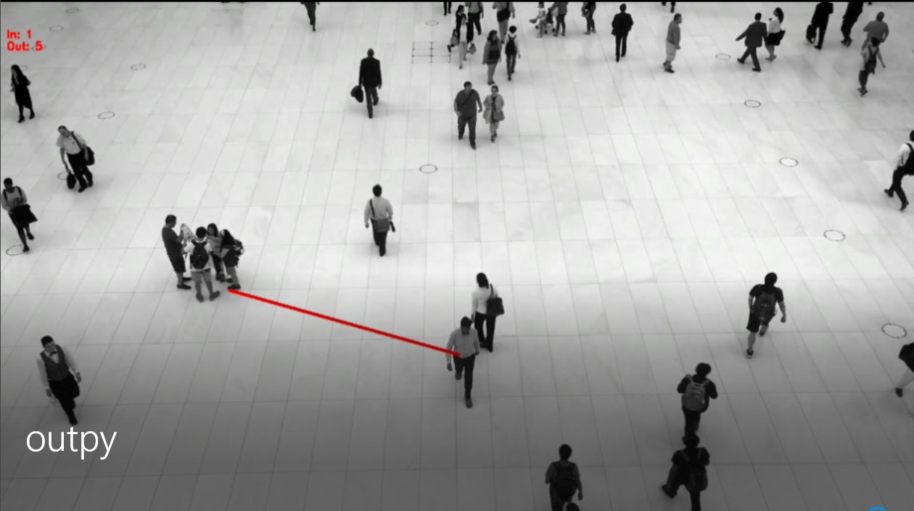
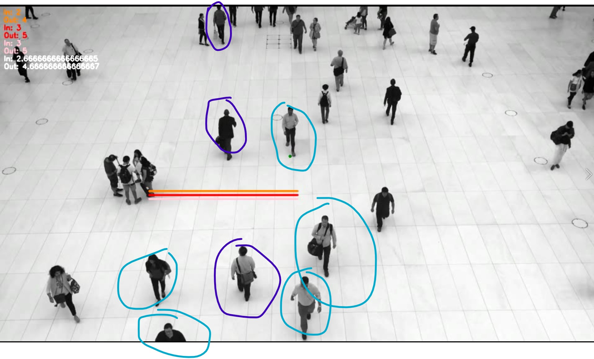
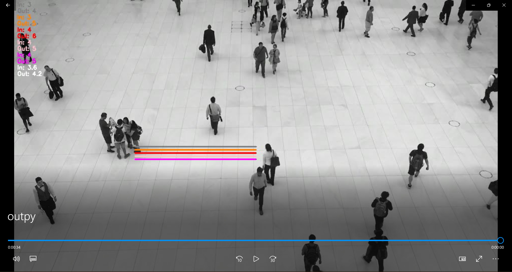

# Virtual Gate Research

To angle the line of interest (LOI), uncomment line 102 of capacitylimit.py.
A future optimization could be to add a flag to toggle between the different types of lines of interest implementations.

## Directions
- In - people going bottom to top in the video in direction
- Out - people going top to bottom in the video in direction

## Implemented Virtual Gates

1. Straight line
2. Angled line
3. Multiple lines
4. 2D vs 3D - TODO?

### Straight Line Results
Difference for both counts if off by one here.

The table below was captured using `072352396-people-pedestrian-zone.mp4`,
and the coordinate configuration set to `"coords": [[20, 45], [40, 45]]` for the LOI.

| Line of Interest        | In - Out Count |
|-------------------------|----------------|
| Single line - red       | 4 - 6          |
| ----------------------- |----------------|
| My ground truth         | 3 - 5          |

Pictured below is what the final frame looks like for a single horizontal line for the LOI.

### Angled Line Results
Difference for both counts is off by a lot here.
> Note: This one was harder to determine the ground truth for a variety of reasons.

The table below was captured using `072352396-people-pedestrian-zone.mp4`,
and the coordinate configuration set to `"coords": [[30, 45], [40, 45]]` for the LOI.

| Line of Interest        | In - Out Count   |
|-------------------------|------------------|
| Angled line - red       | 1 - 5            |
| ----------------------- | ---------------- |
| My ground truth         | 3 - 4            |

### Multiple Line Results
It appears that averaging the results does result in a better in/out count in this case.

The table below was captured using `072352396-people-pedestrian-zone.mp4`,
and the coordinate configuration set to `"coords": [[20, 45], [40, 45]]` for the LOI.

#### 3 Lines of Interest

| Line of Interest      | In - Out Count |
|-----------------------|----------------|
| Line above - orange   | 3 - 5          |
| Middle line - red     | 4 - 6          |
| Below line - pink     | 4 - 5          |
|-----------------------|----------------|
| Average count         | 3.66 - 5.33    |
| My ground truth       | 3 - 5          |

#### 5 Lines of Interest

| Line of Interest        | In - Out Count   |
|-------------------------|------------------|
 | First line - grey       | 3 - 4            |
| Line above - orange     | 3 - 5            |
| Middle line - red       | 4 - 6            |
| Below line - pink       | 4 - 5            |
 | Last line - magenta     | 4 - 5            |
| ----------------------- | ---------------- |
| Average count           | 3.6 - 4.2        |
| My ground truth         | 3 - 5            |

It appears that 3 lines of interest is slightly more accurate than 5 lines of interest in this example.

People circled in purple were counted as `In`.
People circled in blue were counted as `Out`.

> Note: To toggle between line counts, comment out the corresponding lines from line 195-201 as needed of capacitylimit.py.

### 2D vs 3D Line Results
I will check out Go solutions before returning back here for exploration.

## Insights

### Line Distance apart
I randomly chose 10 pixels apart for my LOIs.

### Difficulties
It was really difficult to determine my own ground truth sometimes...

## LOI Recommendation
So far - multiple LOIs and average the results.

