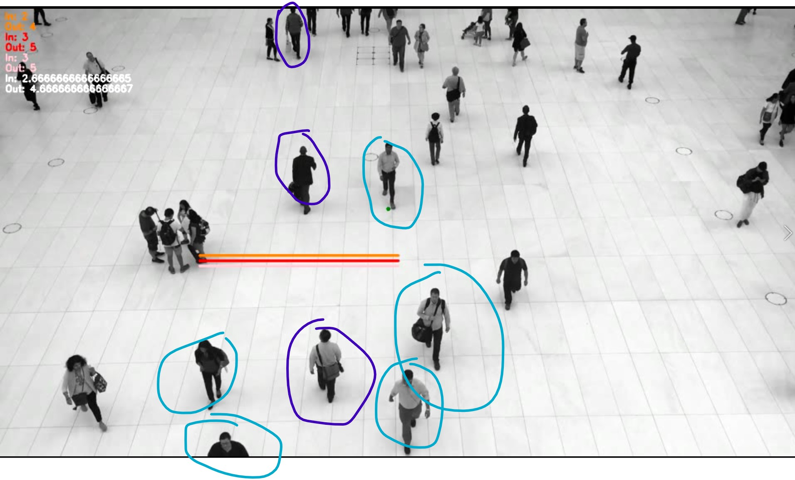

# Virtual Gate Research

To angle the line of interest (LOI), uncomment line 98 of capacitylimit.py.
A future optimization could be to add a flag to toggle between the different types of lines of interest implementations.

## Directions
In - people going bottom to top in the video in direction
Out - people going top to bottom in the video in direction

## Implemented Virtual Gates

1. Straight line
2. Angled line
3. Multiple lines
4. 2D vs 3D - TODO?

### Straight Line Results
TODO

### Angled Line Results
TODO

### Multiple Line Results
It appears that averaging the results does result in a better in/out count in this case.

The table below was captured using `072352396-people-pedestrian-zone.mp4`,
and the coordinates configuration set to `"coords": [[20, 45], [40, 45]]` for the LOI.

| Line of Interest      | In - Out Count |
|-----------------------|----------------|
| Line above - orange   | 3 - 5          |
| Middle line - red     | 4 - 6          |
| Below line - pink     | 4 - 5          |
|-----------------------|----------------|
| Average count         | 3.66 - 5.33    |
| My ground truth       | 3 - 5          |

Pictured below if what I considered to be my ground truth counts.

People circled in purple were counted as `In`.
People circled in blue were counted as `Out`.

### 2D vs 3D Line Results
I will check out Go solutions before returning back here for exploration.

#### Other Insights

##### Line Distance apart
I randomly chose XX pixels apart for my LOIs.